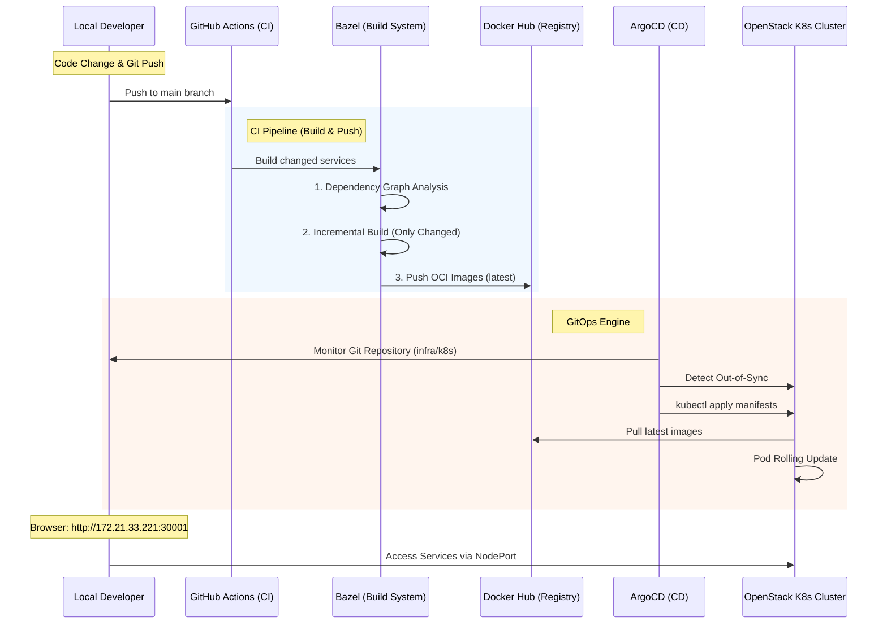

# 🏛 Monorepo Architecture Conclusion: Hangang-Flow

본 문서는 Hangang-Flow 프로젝트에서 채택한 모노레포 아키텍처와 이를 지탱하는 Cloud Native 인프라, 그리고 실제 운영 과정에서의 기술적 고찰을 정리합니다.

## 1. End-to-End Infrastructure & Deployment
본 프로젝트는 **IaC(Terraform) -> CM(Ansible) -> CI/CD(Bazel/Actions) -> GitOps(ArgoCD)**로 이어지는 완벽한 자동화 라인을 구축했습니다.

### 📊 Detailed Deployment Workflow (Mermaid)

## 2. Monorepo Build Strategy (Bazel)
ArgoCD가 배포를 담당한다면, **Bazel은 배포할 '물건'을 가장 효율적으로 만드는 역할**을 합니다.

-   **독립적 선별 빌드**: `apps/` 폴더 내의 FE(React)와 BE(Java/Node.js)는 기술 스택이 다르지만, 하나의 `Bazel` 명령어로 관리됩니다. 수정 시 의존성 그래프를 분석해 **바뀐 모듈만** 빌드합니다.
-   **OCI 이미지 최적화**: Dockerfile 없이도 Bazel이 직접 컨테이너 레이어를 구성하여 매우 빠르고 가벼운 `distroless` 이미지를 생성합니다.
-   **빌드 캐싱**: GitHub Actions의 Runner가 바뀌어도 이전 빌드 결과물을 재사용하여 CI 시간을 획기적으로 단축합니다.

## 3. GitOps Testing Scenarios (ArgoCD)
배포 자동화가 정상적으로 작동하는지 확인하기 위한 테스트입니다.

### ✅ 시나리오 1: 자동 스케일링 테스트
1.  `infra/k8s/exchange-web.yaml`의 `replicas`를 수정 후 `push` 합니다.
2.  **결과**: ArgoCD 웹 UI에서 포드가 자동으로 늘어나는지 확인합니다.

### ✅ 시나리오 2: 자가 치유(Self-healing) 테스트
1.  터미널에서 임의로 포드를 삭제합니다: `kubectl delete pod -l app=exchange-web`
2.  **결과**: ArgoCD가 즉시 불일치를 감지하고 포드를 다시 살려내는지 확인합니다.

---

## 4. Monorepo의 장점 (Pros)
- **Atomic Commits**: 인프라와 앱 코드가 한 번의 커밋으로 관리됨.
- **의존성 단일화**: 중앙 집중식 라이브러리 관리 (`MODULE.bazel`).

## 5. 단점 및 한계 (Cons & Limitations)
- **학습 곡선**: Bazel 설정의 복잡성.
- **보안 제약**: ArgoCD의 외부 심볼릭 링크 거부 이슈 (Bazel 링크 제거로 해결).

## 🏁 최종 결론
Hangang-Flow는 **Bazel의 강력한 빌드 성능**과 **ArgoCD의 안정적인 배포 능력**을 결합하여, 현대적인 MSA 운영의 정석을 구현했습니다.
