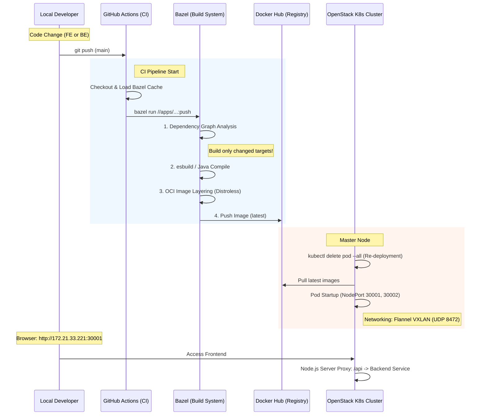

# 🏛 Monorepo Architecture Conclusion: Hangang-Flow

본 문서는 Hangang-Flow 프로젝트에서 채택한 모노레포 아키텍처와 이를 지탱하는 Cloud Native 인프라, 그리고 실제 운영 과정에서의 기술적 고찰을 정리합니다.

## 1. End-to-End Infrastructure & Deployment
본 프로젝트는 **IaC(Terraform) -> CM(Ansible) -> CI/CD(Bazel/Actions)**로 이어지는 표준 파이프라인을 구축했습니다.

1.  **Provisioning**: Terraform을 사용하여 OpenStack 상에 3대의 VM(Master 1, Worker 2)을 자동 생성하고 보안 그룹(VXLAN, NodePort 등)을 설정했습니다.
2.  **Configuration**: Ansible을 통해 모든 노드에 Runtime(containerd) 및 K8s 컴포넌트를 설치하고 클러스터를 조인했습니다.
3.  **CI/CD**: GitHub Actions가 Runner 역할을 수행하며, **Bazel**을 이용해 변경된 서비스만 선별적으로 빌드하여 Docker Hub에 릴리즈합니다.

### 📊 Detailed Deployment Workflow (Mermaid)

## 2. Monorepo Build & Release Strategy

### 🛠 분리된 빌드 및 목업 업데이트
- **독립적 빌드**: `apps/` 폴더 내의 FE(React)와 BE(Java/Node.js)는 서로 다른 기술 스택을 사용하지만, 하나의 `Bazel` 명령어로 통제됩니다. 소스 수정 시 Bazel의 의존성 그래프 분석을 통해 **해당 모듈만** 다시 빌드됩니다.
- **Mock-up & Release**: 프론트엔드 업데이트 시 Node.js 정적 서버와 함께 번들링되어 릴리즈되며, 백엔드 API 주소는 내부 K8s 서비스 이름을 통해 투명하게 연결(Proxy)됩니다.

## 3. Monorepo의 장점 (Pros)
- **Atomic Commits**: 인프라 설정(Terraform), 배포 스크립트(Ansible), FE/BE 코드가 한 번의 커밋으로 관리되므로 전체 시스템의 형상 관리가 매우 용이합니다.
- **의존성 단일화**: 프로젝트 전체에서 사용하는 라이브러리 버전을 `MODULE.bazel`에서 한 번에 관리하여 버전 충돌을 방지합니다.
- **빌드 가속화 (Caching)**: Bazel의 원격/로컬 캐싱 덕분에 푸시마다 전체를 다 굽지 않고, 바뀐 부분만 릴리즈하는 초고속 파이프라인이 가능합니다.

## 4. 모노레포의 단점 및 한계 (Cons & Limitations)
- **높은 학습 곡선**: Bazel 설정(`BUILD` 파일 작성 등)이 일반적인 빌드 도구보다 복잡하며, 샌드박스 환경에서의 파일 경로 처리가 까다롭습니다.
- **환경 의존성**: 이번 `distroless` 포트 권한 이슈나 `Security Group` UDP 누락 사례처럼, 인프라와 앱 설정이 밀접하게 결합되어 있어 디버깅 시 넓은 시야가 요구됩니다.
- **CI 자원 소모**: 프로젝트 규모가 거대해질 경우, 캐시가 없는 첫 빌드 시 GitHub Actions의 자원을 과도하게 소모할 수 있습니다.

## 🏁 최종 결론
Hangang-Flow는 모노레포 구조를 통해 **"인프라부터 코드까지 한 몸처럼 움직이는 클라우드 네이티브 환경"**을 성공적으로 구현했습니다. 복잡한 초기 설정 단계를 넘어서면, 서비스 간 통합 테스트와 배포 자동화 측면에서 멀티 레포지토리 방식보다 압도적인 운영 효율성을 제공합니다.
